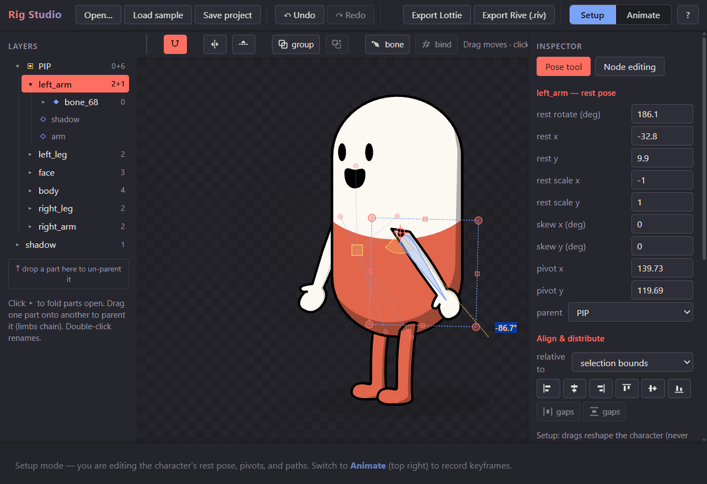

# Rig Studio

A browser-based 2D rigging and animation editor for SVG artwork — bones, groups,
inverse kinematics, skinning, a keyframe timeline with a curve editor, Rive-style
state machines, and an AI animation assistant. Exports **Rive `.riv`** files (play
anywhere the official Rive runtimes run: web, Android, iOS, Flutter, React Native,
Unity) and **Lottie JSON**.



```sh
npm install
npm run dev        # http://localhost:5173
npm run build      # type-check + production build
npm test           # unit tests (vitest)

npm preview        # run production preview server (no file watching, make sure build first)

npm run pages      # build github pages folder (make sure to commit and push)
```

## Workflow

1. **Import** — `Open…` an SVG (or `Load sample`). Each named group
   (`inkscape:label`) becomes a rig part; ellipses/circles/rects convert to paths. A
   group transform of the form `rotate(a, cx, cy)` — or the equivalent `matrix(...)`
   Inkscape rewrites it into — seeds the part's pivot, so pre-rigged joints import
   for free.
2. **Rig (Setup mode)** — move/scale/rotate/skew parts Inkscape-style, drag pivots
   (the artwork never shifts), parent parts into bone hierarchies, place bones and
   IK chains, group with Ctrl+G, bind artwork to bones for skinned deformation, and
   edit path nodes (insert/delete/join/split, segment bending, persistent node
   types). Toggleable snapping (`%`) covers nodes, pivots, and bounding boxes.
3. **Animate** — pose parts on the canvas to auto-key at the playhead; clips
   organize animations (one clip per action/mood). The timeline offers marquee key
   selection, retiming, copy/paste, per-key easing presets, and a curve editor with
   custom cubic beziers.
4. **State machines** — the timeline's `🔀 logic` view: define inputs
   (bool/number/trigger), states bound to clips, transitions with conditions and
   crossfade blends, and pointer listeners on parts. Preview runs the machine live
   on the canvas — clicks on the artwork fire listeners.
5. **AI assistant** — enter an Anthropic API key (stored locally, sent only to
   `api.anthropic.com`), describe motion in plain language, and the assistant writes
   or critiques the active clip's choreography; optionally allow it to make
   structural rig changes.
6. **Export** — `Export Rive (.riv)`: the whole document, every clip as a named
   animation plus state machines, playable in the official Rive runtimes (reference
   animations and inputs by name, e.g. from `rive-android`). `Export Lottie
   (.json)`: one clip as a Lottie file. `Save project` round-trips everything as
   `.rig.json` (autosaved to localStorage).

Press `?` in the app for the complete keyboard-shortcut reference.

## Documentation

- [CLAUDE.md](CLAUDE.md) — architecture, invariants ("conventions that must hold"),
  and the verified status log.
- [ROADMAP.md](ROADMAP.md) — feature history (v1–v2.9), committed next steps, and
  the future list.

## Semantics (the short version)

- Coordinates are SVG document space: +y down, positive rotation clockwise.
- Keyframed values are absolute; the rest pose fills unkeyed channels.
- Every part rotates around its own pivot; parenting composes like a bone hierarchy;
  `root` translates/scales the whole figure.
- Easing lives on the arriving keyframe; custom curve-editor beziers override
  presets everywhere, including exports.
